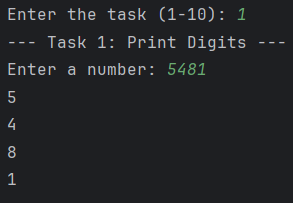
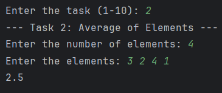
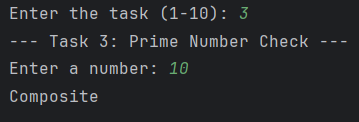
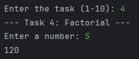
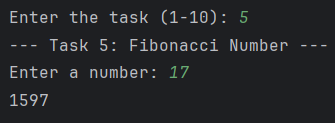
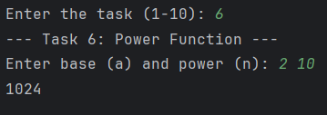
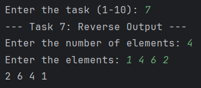
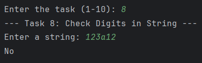
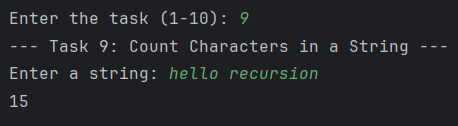
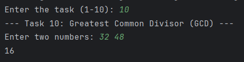

# ADS: Assignment 1

## Information
**Student:** Anas Boranbayev  
**Group:** SE-2511

## Summary of Work Process
* **Architecture:** I separated my code into three distinct classes to follow professional design principles: `Main.java` acts as the Controller/Menu, `IOHandler.java` handles the user prompts and Scanner inputs to keep the logic clean, and `Solution.java` contains the pure recursive mathematical logic.
* **Input Validation & Optimization:** I utilized the **Public/Private Wrapper pattern**. The public methods handle initial input validation (throwing `IllegalArgumentException` for invalid data), while the private helper methods perform the actual recursion. This optimizes performance by ensuring validation only occurs once per task instead of on every recursive call.
* **No Loops:** I successfully replaced all `for` and `while` loops (including array population) with recursive helper methods to strictly follow the assignment constraints.

## How to Run
1. Clone this repository to your local machine.
2. Open the project in your preferred IDE (e.g., IntelliJ IDEA) and ensure the `src` folder is marked as the Sources Root.
3. Run the `Main` class.
4. Follow the interactive console menu to test each task (1-10).

---

## Documentation

### Part 1: Recursion with Numbers

**Task 1: Print Digits of a Number**  
*Explanation:* Used modulo (`% 10`) to isolate the last digit and integer division (`/ 10`) to pass the remaining number. I controlled the print order by placing the `System.out.println` *after* the recursive call.  

**Task 2: Average of Elements**  
*Explanation:* Wrote a recursive `fillArray` method to populate the array without loops, then passed the array to a recursive sum function to calculate the final average.  

**Task 3: Prime Number Check**  
*Explanation:* Optimized the recursion by passing a `div` parameter and stopping early if `div * div > n` (checking only up to the square root to save memory and execution time).  

**Task 4: Factorial**  
*Explanation:* Implemented the standard mathematical factorial formula recursively, using a public wrapper method to catch negative inputs with an `IllegalArgumentException`.  

---

### Part 2: Recursion with Sequences

**Task 5: Fibonacci Number**  
*Explanation:* Used branching recursion (`fib(n-1) + fib(n-2)`) to calculate the sequence, protected by a public wrapper method to prevent math failures on negative indices.  

**Task 6: Power Function**  
*Explanation:* Used recursion to multiply the base by itself `n` times, with a base case returning `1` when the exponent reaches `0`.  

**Task 7: Reverse Output**  
*Explanation:* Read the input but placed the `print` command *after* the recursive call. This forced the Call Stack (Last-In, First-Out) to hold onto the first numbers and print them last, successfully reversing the output without using an array.  

---

### Part 3: Recursion with Strings

**Task 8: Check Digits in String**  
*Explanation:* Used an index pointer (`int i`) to check `Character.isDigit` at each position. It returns false if a non-digit is found, or true if the index safely reaches the end of the string. This avoids creating memory-heavy substrings.  

**Task 9: Count Characters in a String**  
*Explanation:* Used an index pointer to traverse the string, returning `1 + countCharacters(...)` for each character until the index equals the string's length.  

**Task 10: Greatest Common Divisor (GCD)**  
*Explanation:* Implemented the Euclidean Algorithm recursively (`findGCD(b, a % b)`), using `Math.abs()` in a public wrapper method to ensure mathematical accuracy for negative inputs.  

